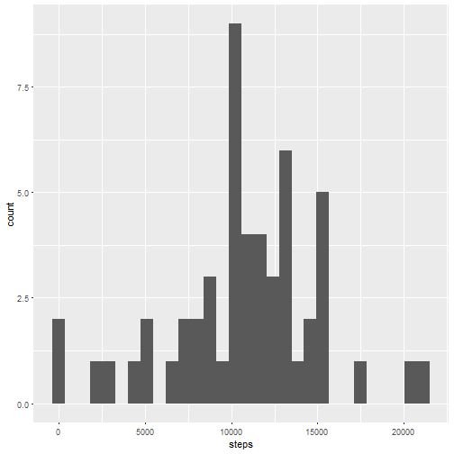

# Reproducible Research Week 2 Assignment
=========================================

## Task 1: Loading and preprocessing the data
- Downloading the data
- Unzipping the original data file
- Loading the data into an 'R' object via the read.csv() funtion.

```r
knitr::opts_chunk$set(echo = TRUE)
download.file(url = "https://d396qusza40orc.cloudfront.net/repdata%2Fdata%2Factivity.zip",destfile = "Rep Research Week2.zip")
data <- read.csv(unzip("Rep Research Week2.zip"))
```

## Task 2: What is mean total number of steps taken per day
2.1 Calculate the total number of steps taken per day

```r
data_noNA <- data[!is.na(data$'steps'),]

#using an SQL style query to create a dataframe containing average steps per day by date.
library(sqldf)
```

```
## Loading required package: gsubfn
```

```
## Loading required package: proto
```

```
## Loading required package: RSQLite
```

```
## Loading required package: DBI
```

```r
total_steps_perday <- sqldf("select sum(steps),date from data_noNA group by date")
```

```
## Loading required package: tcltk
```

```r
colnames(total_steps_perday) <- c("steps","date")
#The total number of steps per day is:
total_steps_perday
```

```
##    steps       date
## 1    126 2012-10-02
## 2  11352 2012-10-03
## 3  12116 2012-10-04
## 4  13294 2012-10-05
## 5  15420 2012-10-06
## 6  11015 2012-10-07
## 7  12811 2012-10-09
## 8   9900 2012-10-10
## 9  10304 2012-10-11
## 10 17382 2012-10-12
## 11 12426 2012-10-13
## 12 15098 2012-10-14
## 13 10139 2012-10-15
## 14 15084 2012-10-16
## 15 13452 2012-10-17
## 16 10056 2012-10-18
## 17 11829 2012-10-19
## 18 10395 2012-10-20
## 19  8821 2012-10-21
## 20 13460 2012-10-22
## 21  8918 2012-10-23
## 22  8355 2012-10-24
## 23  2492 2012-10-25
## 24  6778 2012-10-26
## 25 10119 2012-10-27
## 26 11458 2012-10-28
## 27  5018 2012-10-29
## 28  9819 2012-10-30
## 29 15414 2012-10-31
## 30 10600 2012-11-02
## 31 10571 2012-11-03
## 32 10439 2012-11-05
## 33  8334 2012-11-06
## 34 12883 2012-11-07
## 35  3219 2012-11-08
## 36 12608 2012-11-11
## 37 10765 2012-11-12
## 38  7336 2012-11-13
## 39    41 2012-11-15
## 40  5441 2012-11-16
## 41 14339 2012-11-17
## 42 15110 2012-11-18
## 43  8841 2012-11-19
## 44  4472 2012-11-20
## 45 12787 2012-11-21
## 46 20427 2012-11-22
## 47 21194 2012-11-23
## 48 14478 2012-11-24
## 49 11834 2012-11-25
## 50 11162 2012-11-26
## 51 13646 2012-11-27
## 52 10183 2012-11-28
## 53  7047 2012-11-29
```


2.2 Make a histogram of the total number of steps taken each day

```r
library(ggplot2)
```

```
## Warning: package 'ggplot2' was built under R version 3.3.2
```

```r
ggplot(data=total_steps_perday) + geom_histogram(mapping = aes(x= steps))
```

```
## `stat_bin()` using `bins = 30`. Pick better value with `binwidth`.
```



2.3 Calculate and report the mean and median of the total number of steps taken per day:

```r
mean <- mean(total_steps_perday$steps)
median <- median(total_steps_perday$steps)
```
The mean is 1.0766189 &times; 10<sup>4</sup>
The median is 10765

## Task 3: What is the average daily activity pattern?
3.1 Make a time series plot (i.e. type = "l") of the 5-minute interval (x-axis) and the average number of steps taken, averaged across all days (y-axis)

```r
average_steps_perinterval <- sqldf("select avg(steps),interval,count(*) from data_noNA group by interval")
colnames(average_steps_perinterval) <- c("avg_steps","interval","count")

## The followiing graph depicts thew timeseries plot of average no. of steps across various 5 minute intervals.
ggplot(average_steps_perinterval, aes(interval, avg_steps)) + geom_line() + ylab("Avg. no. of Steps") + xlab("interval")
```


3.2 Which 5-minute interval, on average across all the days in the dataset, contains the maximum number of steps?

```r
max_average_interval <- average_steps_perinterval[max(average_steps_perinterval$'avg_steps'),]
max_average_interval
```

```
##     avg_steps interval count
## 206  56.30189     1705    53
```
The average max average of steps is 56.3018868

## Task 4: Imputing missing values
4.1 Calculate and report the total number of missing values in the dataset (i.e. the total number of rows with NAs)

```r
data_NAs <- data[is.na(data$'steps'),]
number_of_NAs <- nrow(data_NAs)
number_of_NAs
```

```
## [1] 2304
```
The total number of NAs is 2304

4.2 Devise a strategy for filling in all of the missing values in the dataset. The strategy does not need to be sophisticated. For example, you could use the mean/median for that day, or the mean for that 5-minute interval, etc.

```r
replace_NAs <- data_NAs
average_steps_perday1 <- sqldf("select avg(steps),interval from data_noNA group by interval")
colnames(average_steps_perday1) <- c("steps2","interval")

replace_NAs_final <- sqldf("select a.steps, a.date, a.interval, b.steps2 from replace_NAs a left join average_steps_perday1 b on a.interval = b.interval")
replace_NAs_final1 <- as.data.frame(cbind(replace_NAs_final$steps2,as.character(replace_NAs_final$date),replace_NAs_final$interval))
colnames(replace_NAs_final1) <- colnames(data)
```
4.3 Create a new dataset that is equal to the original dataset but with the missing data filled in.

```r
reconstructed <- rbind(data_noNA,replace_NAs_final1)
```

4.4 Make a histogram of the total number of steps taken each day and Calculate and report the mean and median total number of steps taken per day. Do these values differ from the estimates from the first part of the assignment? What is the impact of imputing missing data on the estimates of the total daily number of steps?

```r
library(ggplot2)
library(sqldf)
total_steps_imputed <- sqldf("select sum(steps),date from reconstructed group by date")
# The total number of steps per day (after imputing NAs) is:
total_steps_imputed
```

```
##    sum(steps)       date
## 1    10766.19 2012-10-01
## 2      126.00 2012-10-02
## 3    11352.00 2012-10-03
## 4    12116.00 2012-10-04
## 5    13294.00 2012-10-05
## 6    15420.00 2012-10-06
## 7    11015.00 2012-10-07
## 8    10766.19 2012-10-08
## 9    12811.00 2012-10-09
## 10    9900.00 2012-10-10
## 11   10304.00 2012-10-11
## 12   17382.00 2012-10-12
## 13   12426.00 2012-10-13
## 14   15098.00 2012-10-14
## 15   10139.00 2012-10-15
## 16   15084.00 2012-10-16
## 17   13452.00 2012-10-17
## 18   10056.00 2012-10-18
## 19   11829.00 2012-10-19
## 20   10395.00 2012-10-20
## 21    8821.00 2012-10-21
## 22   13460.00 2012-10-22
## 23    8918.00 2012-10-23
## 24    8355.00 2012-10-24
## 25    2492.00 2012-10-25
## 26    6778.00 2012-10-26
## 27   10119.00 2012-10-27
## 28   11458.00 2012-10-28
## 29    5018.00 2012-10-29
## 30    9819.00 2012-10-30
## 31   15414.00 2012-10-31
## 32   10766.19 2012-11-01
## 33   10600.00 2012-11-02
## 34   10571.00 2012-11-03
## 35   10766.19 2012-11-04
## 36   10439.00 2012-11-05
## 37    8334.00 2012-11-06
## 38   12883.00 2012-11-07
## 39    3219.00 2012-11-08
## 40   10766.19 2012-11-09
## 41   10766.19 2012-11-10
## 42   12608.00 2012-11-11
## 43   10765.00 2012-11-12
## 44    7336.00 2012-11-13
## 45   10766.19 2012-11-14
## 46      41.00 2012-11-15
## 47    5441.00 2012-11-16
## 48   14339.00 2012-11-17
## 49   15110.00 2012-11-18
## 50    8841.00 2012-11-19
## 51    4472.00 2012-11-20
## 52   12787.00 2012-11-21
## 53   20427.00 2012-11-22
## 54   21194.00 2012-11-23
## 55   14478.00 2012-11-24
## 56   11834.00 2012-11-25
## 57   11162.00 2012-11-26
## 58   13646.00 2012-11-27
## 59   10183.00 2012-11-28
## 60    7047.00 2012-11-29
## 61   10766.19 2012-11-30
```

```r
colnames(total_steps_imputed) <- c("steps","date")
# Histogram of total steps after imputing:
ggplot(data=total_steps_imputed) + geom_histogram(mapping = aes(x= steps))
```

```
## `stat_bin()` using `bins = 30`. Pick better value with `binwidth`.
```


## 5. Are there differences in activity patterns between weekdays and weekends?
5.1 Create a new factor variable in the dataset with two levels weekdays and weekends indicating whether a given date is a weekday or weekend day.

```r
weekdays <- reconstructed
weekdays[,"weekday"] <- NA #adding a blank column to use as a weekend/weekday indicator.

#using a custom function along with function sapply() to add a flag called "weekday" that indicates whether
#a row corresponds to a Weekend observation or a Weekday observation.
return_weekday <- function(x){   
  if(weekdays(x) %in% c("Saturday","Sunday"))
     {
       return("Weekend")
  }
     return("Weekday")
}

weekdays$weekday <- sapply(as.Date(weekdays$date), function(t) return_weekday(t))
weekdays$steps <- as.numeric(weekdays$steps) #updating the weekday derived, into the data frame
```
5.2 Make a panel plot containing a time series plot (i.e. type = "l") of the 5-minute interval (x-axis) and the average number of steps taken, averaged across all weekday days or weekend days (y-axis). See the README file in the GitHub repository to see an example of what this plot should look like using simulated data.

```r
library(ggplot2)
library(sqldf)
plot1 <- sqldf("select avg(steps),interval, weekday from weekdays group by interval, weekday")
str(plot1)
```

```
## 'data.frame':	576 obs. of  3 variables:
##  $ avg(steps): num  2.2512 0.2146 0.1732 0.0165 0.4205 ...
##  $ interval  : chr  "0" "0" "10" "10" ...
##  $ weekday   : chr  "Weekday" "Weekend" "Weekday" "Weekend" ...
```

```r
colnames(plot1) <- c("steps","interval","weekday")
ggplot(plot1, aes(as.numeric(interval), steps)) + geom_line() + ylab("Avg. no. of Steps") + xlab("interval") + facet_wrap(~weekday, nrow = 2)
```


